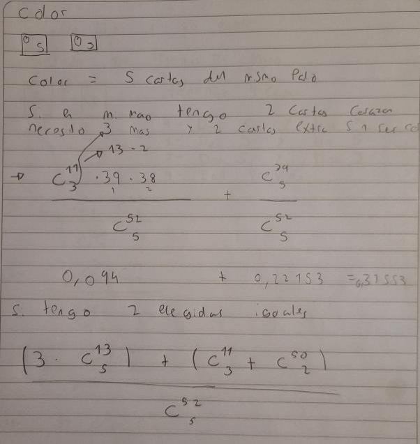
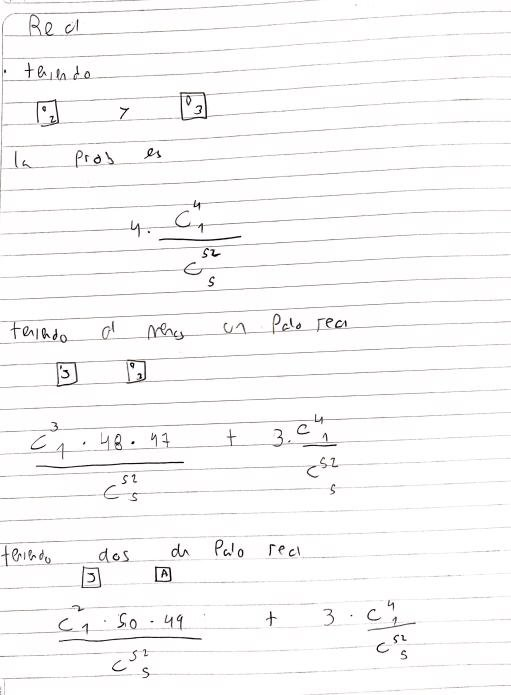
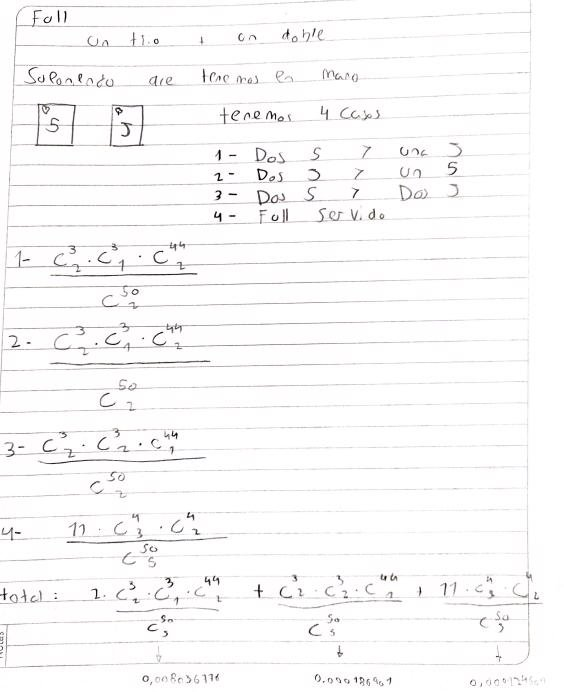
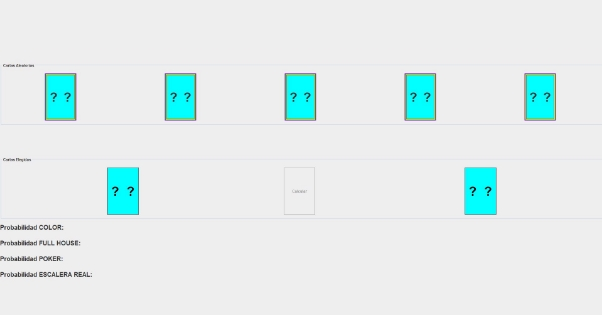
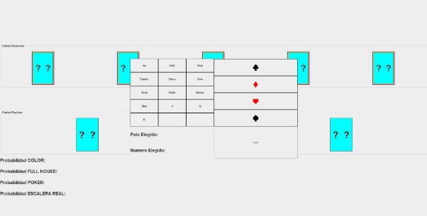
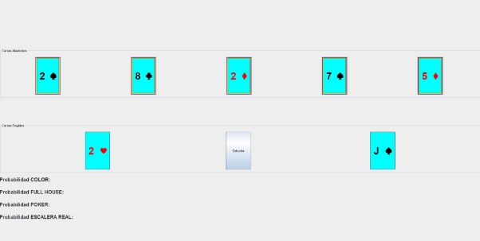
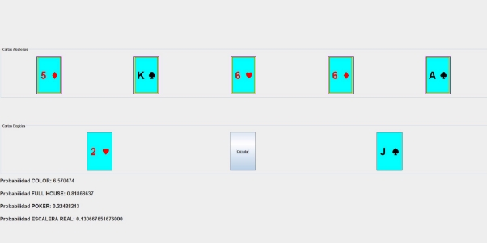

Informe matemático de las          probabilidades en los juegos del poker

Lucas Giffuni

[**Presentación:](#_page2_x72.00_y86.55) **[3** ](#_page2_x72.00_y86.55)[Póker:](#_page2_x72.00_y371.73) [3**](#_page2_x72.00_y371.73)**

[**Cálculo adicional del resto de juegos](#_page4_x72.00_y115.64) **[5** ](#_page4_x72.00_y115.64)[Color](#_page4_x72.00_y197.18)** [5 ](#_page4_x72.00_y197.18)[Escalera Real](#_page5_x72.00_y72.00) [6 ](#_page5_x72.00_y72.00)[Full House](#_page6_x72.00_y72.00) [7](#_page6_x72.00_y72.00)

[**Aplicación probabilística](#_page7_x72.00_y86.55) **[8** ](#_page7_x72.00_y86.55)[Abrir Aplicación:](#_page7_x72.00_y182.63)** [8 ](#_page7_x72.00_y182.63)[Funcionamiento:](#_page7_x72.00_y285.86) [8 ](#_page7_x72.00_y285.86)[Interfaz Gráfica:](#_page7_x72.00_y491.03) [8](#_page7_x72.00_y491.03)

Presentación:

Basándonos en la consigna propuesta por el Prof. Carlos Presa donde debemos de aplicar (simplificadamente) la lógica de un juego Poker tipo Texas, donde se debe de ingresar 2 cartas a modo de input y utilizando esas 2 cartas y las 5 otras posibles cartas, deberemos de calcular las posibilidades de que los juegos en cuestión se formen.

En concreto se solicita simular el juego de Poker de 1 persona mostrando cómo output la posibilidad de que se formen los juegos:

1. Color
1. Full House (O Full)
1. Póker
1. Escalera Real

A continuación, explicaré la lógica del juego Póker y cómo influyen las probabilidades en los casos.

Póker:

El juego **Póker ,** es una combinación que contiene cuatro cartas del mismo valor y una carta cualquiera:

En un primer lugar, hay que saber la cantidad totales de juegos que podemos hacer, eso se calcula de la siguiente manera:

52 5

Esto significa la cantidad total de combinaciones tomando 5 cartas sin importar el orden, por eso usamos Combinaciones. Dando un total de 2.598.960 posibilidades de elegir 5 cartas.

Elegiremos 2 cartas al azar::

Y analizando cómo se comporta el juego **Póker** podemos detectar 3 casos:

1. Salen 3  y una carta aleatoria
1. Salen 4  y una carta aleatoria
1. Sale un **Póker** servido.

Caso 1:

3 48 \*  

3 2

50 5

Caso 2: (Simil caso 1)

3 48 \*  

3 2

50 5

Caso 3:

13   \*    4 \* 4    \*   12 1 1 1 1

50 5

Sumando los 3 casos obtenemos la posibilidad total de obtener el juego Póker.

Nótese que todos los casos se dividen sobre la cantidad total de juegos, esto nos da la probabilidad de sacar los juegos en cuestión en todos los juegos.

Cálculo adicional del resto de juegos

A continuación se explicarán los diferentes cálculos del resto de juegos en papel.

Color

Escalera Real

Full House

Aplicación probabilística

A continuación explicaré el funcionamiento de la aplicación desarrollada para representar estos juegos y sus probabilidades.

Abrir Aplicación:

Para poder abrir la aplicación es necesario tener instalado java (instalar desde [aqui](https://www.java.com/es/download/)). Hay que abrir el archivo ProbabilidadesPoker.jar

Funcionamiento:

La aplicación consta de 3 partes:

1. Cartas Aleatorias: En esta sección se simulan las 5 posibles cartas que pueden salir, cambiando constantemente para dar esa ilusión de aleatoriedad.
1. Cartas Elegidas: Esta es la sección donde elegiremos nuestras 2 cartas y donde estará el botón para calcular las probabilidades en cuestión.
1. Probabilidades: Es la sección donde se mostrarán, en función de las 2 cartas elegidas en la sección anterior, las probabilidades de los juegos correspondientes.

Interfaz Gráfica:

Una vez abierta la aplicación se encontrará con lo siguiente:

Para seleccionar las cartas de nuestra mano deberemos de hacer click en la carta en cuestión y se desplegará una pantalla para elegir tanto **número** como **palo**.

Una vez seleccionado número y palo podremos cerrar esta ventana para hacer efectivo la selección de la carta.

Ejemplo de  si queremos seleccionar la carta **2 de Corazón y J de Pica:**

**(Nótese que hay 5 cartas aleatorias, éstas irán cambiando para representar la aleatoriedad.)**

Una vez elegidas las dos cartas se habilita el botón “Calcular” para desplegar las probabilidades.

**Es posible ir modificando las 2 cartas elegidas y dando a calcular para ver los diferentes resultados.**

**En caso de algún problema es recomendable cerrar y volver a abrir la aplicación.**
